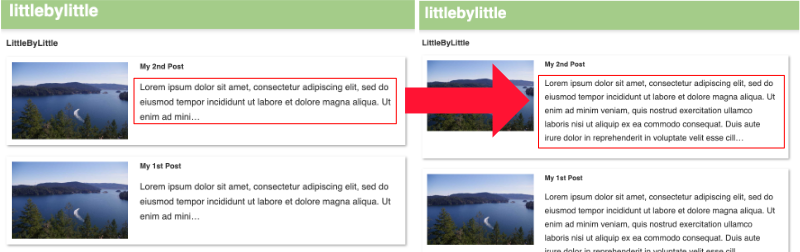

Gatsbyでblogを書くのに便利なのがマークダウンで記事を書いていけるところ。ただ最初はマークダウンに対応してないのでプラグインを導入します。
プラグインの`gatsby-transformer-remark` でマークダウンの内容を書き出してくれます。

そしてGraphQLのサーバーで内容を確認してみると、`node`の中にある`excerpt`がコンテンツの冒頭内容を切り出して表示してくれます。

/src/pages/index.js

```GraphQL
export const query = graphql`
  query {
    allMarkdownRemark {
      edges {
        node {
          id
          excerpt(pruneLength: 100)
          frontmatter {
            title
            date
          }
        }
      }
    }
  }
`
```

### excerptのオプション

#### Length

デフォルトでは先頭から140文字を切り出して表示するのでここを変更すると文字数が変更されます。

`excerpt(pruneLength: 500)`



#### Format

デフォルトではプレーンのテキストで表示されます。
他にも

- `excerpt(format: PLAIN)` <- default
- `excerpt(format: HTML)`
- `excerpt(format: MARKDOWN)`

などを指定して取得できます。

#### truncate

デフォルトでは英語などのラテン文字以外の文字は正しく表示されません。文字数を超えると`...` のみ表示されてしまいます。
それを防ぐためには、`excerpt(truncate: true)`でtruncateをtrueに設定します。

ちなみに複数の場合はコンマで区切れば大丈夫です。
`excerpt(truncate: true, pruneLength: 100)`
