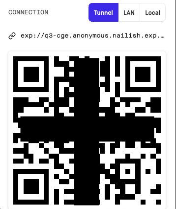

### Expoインストール

とにもかくにもExpoをインストールします。  
Node.jsが必要なのでv10以上を先にインストールしておきます。

- PC - macOS Catalina 10.15.2
- node - v10.16.2
- yarn - v1.21.0
- expo - 3.11.5

コマンドを入力

`npm install -g expo-cli`

ついでにiphoneのExpoアプリもApp Storeからダウンロードしておきましょう。
登録はとくに必要なく使えます。

### プロジェクト作成

自分の好きなディレクトリに`cd`コマンドで移動してExpoのプロジェクトを作成します。

`expo init`

するといくつか聞かれるので矢印キーで選択して進めます。


とりあえず空のテンプレートのblankを選択。

次はプロジェクト名を決めます。


好きな名前を入れてください。

次は、パソコンにYarnが入っていたらYarnを使うかどうか聞いてきます。


npmでもyarnどちらでもいいです。今回は`Y`でyarnを選択。

初期のディレクトリはこんな感じです。


ちなみに`package.json`はこんな感じです。

```json:title=package.json
{
  "main": "node_modules/expo/AppEntry.js",
  "scripts": {
    "start": "expo start",
    "android": "expo start --android",
    "ios": "expo start --ios",
    "web": "expo start --web",
    "eject": "expo eject"
  },
  "dependencies": {
    "expo": "~36.0.0",
    "react": "~16.9.0",
    "react-dom": "~16.9.0",
    "react-native": "https://github.com/expo/react-native/archive/sdk-36.0.0.tar.gz",
    "react-native-web": "~0.11.7"
  },
  "devDependencies": {
    "babel-preset-expo": "~8.0.0",
    "@babel/core": "^7.0.0"
  },
  "private": true
}
```

`react-native`のdependencyがバージョン指定せずにExpoが管理しているということは自分でバージョンアップしなくていいということかな？
最近は頻繁にバージョンアップもあるし、手動で結構エラーになっていたのでこれは楽かもしれない。

### アプリを立ち上げる

`package.json`にscriptがすでに書かれているので`yarn start`でExpoが立ち上がってくれます。  
`expo start`でもOK。

するとwebブラウザが立ち上がります。


左下のQRコードをiOSカメラで読み取ると、iphoneのExpoを開くか聞かれるます。
これで自分のiphoneでプロジェックトが確認できます。

このとき左下の`CONNECTION`を`LAN`なら同じWi-Fi環境であれば認識してくれます。`Tunnel`なら普通の通信でURLから見れます。



開くとExpoが勝手にコンパイルして表示してくれます。少しお待ちください


できた〜！！超簡単。

### テキスト変更してみる

せっかくなのでテキストを変更してみます。
`App.js` の中身を変更します。このファイルが最初のエントリーポイントになります。

```js:title=App.js
〜〜〜
export default function App() {
  return (
    <View style={styles.container}>
-      <Text>Open up App.js to start working on your app!</Text>
+      <Text>Hello World!! インストールできた！！</Text>
    </View>
  );
}
〜〜〜
```
  


できた！！
ファイルを保存すると即座に反映されます。これは便利。
ネイティブの場合はいちいちコンパイルしないといけなかったので画面の確認がとても早いです。こりゃいいや。
