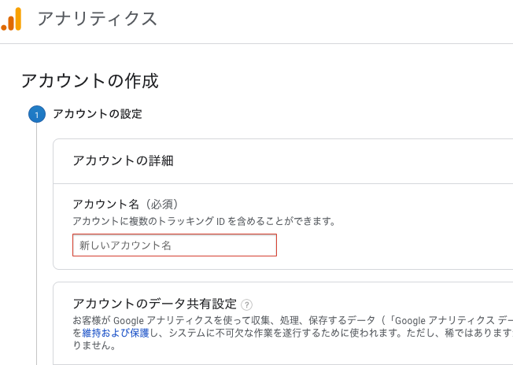
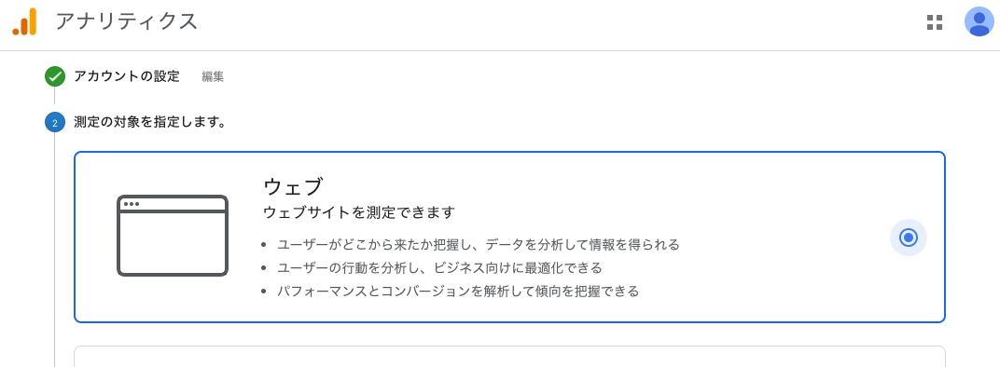
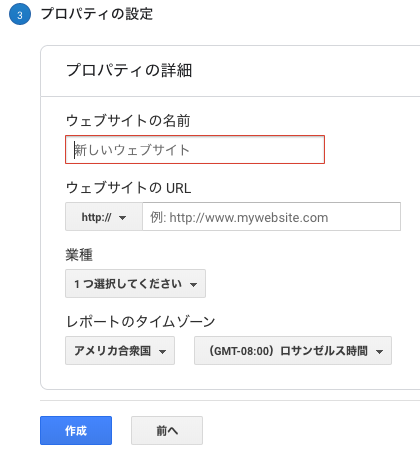
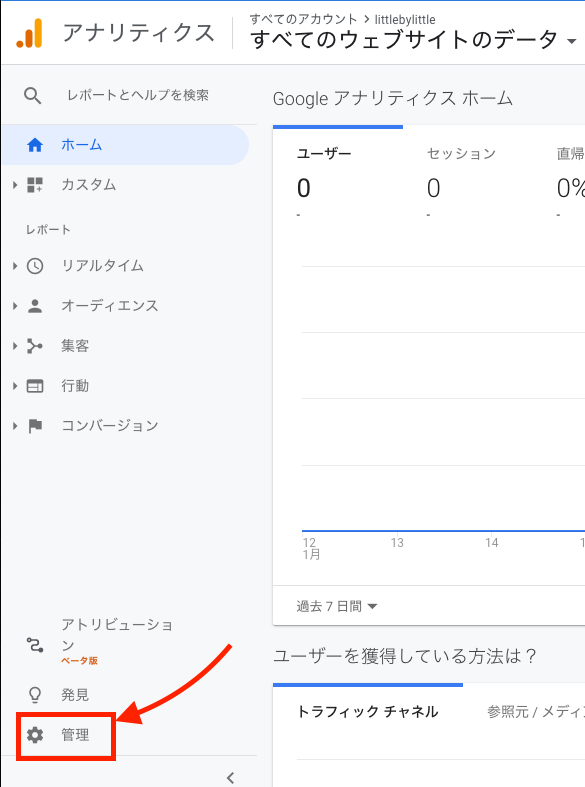
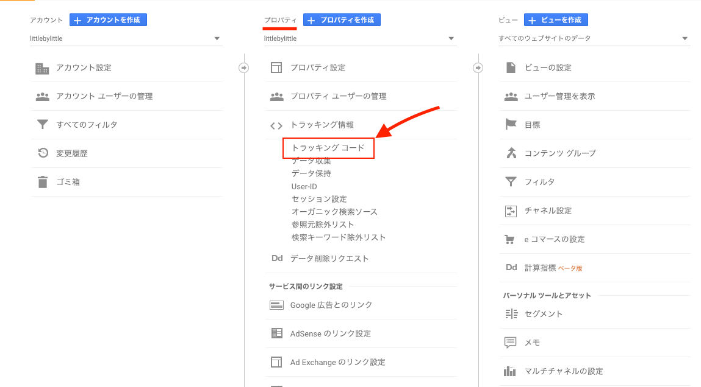
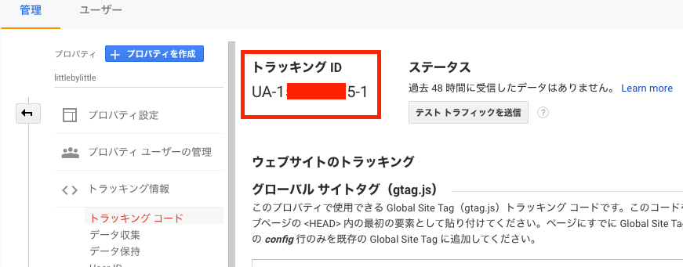
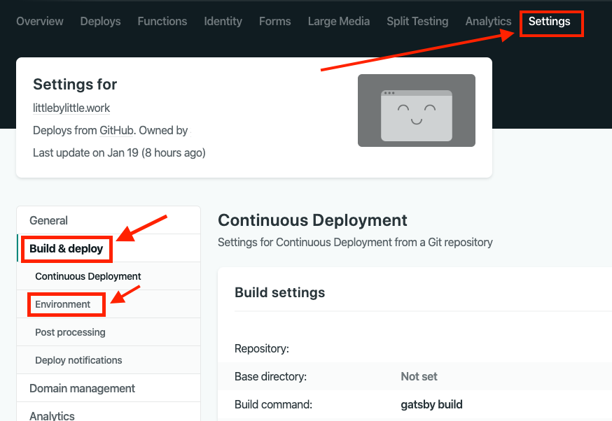
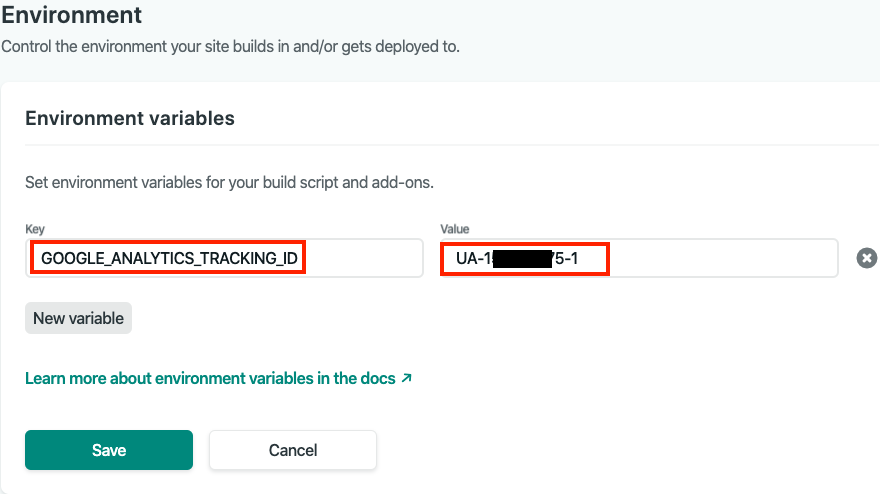

### Google analyticsを導入する

Gatsbyで作成したブログサイトにGoogle analyticsを入れてどのくらいの訪問があるか計測してみましょう。

#### Google analyticsを設定してトラッキングIDを取得する

まずGoogle analyticsのページへ行きトラッキングIDを取得します。

Googleアカウトでログインしてサイトを登録します。



アカウント名を新しく決めて、測定対象をウェブで選択。



ウェブサイトの名前を好きなように決めて、サイトのURLを入力。あとはタイムゾーンと業種を適当に選んで終了。



左のメニューの管理画面へ



プロパティのトラッキング情報のトラッキングコードをクリックするとトラッキングIDが確認できます。



こちらをコピーしましょう。



#### Gatsbyのプロジェクトにプラグインをインストールする

Gatsbyでは[gatsby-plugin-google-analytics](https://www.gatsbyjs.org/packages/gatsby-plugin-google-analytics/)のプラグインをいれれば簡単に導入できます。

まずはGatsbyのプロジェクトにプラグインをインストールしましょう。

```bash:title=terminal
// npm
npm install --save gatsby-plugin-google-analytics

//yarn
yarn add gatsby-plugin-google-analytics
```

`gatsby-config.js` を変更して先ほど取得したgoogleのトラッキングIDを埋め込みます。

公式でのページでは、

```javascript:title=gatsby-config.js
module.exports = {
  plugins: [
    {
      resolve: `gatsby-plugin-google-analytics`,
      options: {
        trackingId: "ここにトラッキングID",
      },
    },
    // 以下いろいろ設定省略
  ]
},
```

となっています。
もちろんこれで動くのですが、GitHubにパブリックリポジトリでpushした場合丸見えなので少し隠してみます。
いろいろ方法はあるとは思いますので参考までに。

#### 1.NetlifyにHostingしている場合

GatsbyのサイトをNetlifyでHostingしている場合も多いかと思いますが、その場合はNetlify側のSettingで設定できます。

まずNetilyにログインして自分のプロジェクトに入り`Setting`を選択。
左側のメニューの`Build&develop`を選択、そして`Enviroment`を選択。



`New variable`をクリックしてKey名とトラッキングIDを入力します。
Keyはなんでもいいのですが、定数という意味で大文字、なおかつわかりやすい名前ということで`GOOGLE_ANALYTICS_TRACKING_ID`としておきます。そしてvalueにトラッキングIDを入力します。最後に`save`します。



最後にプロジェクトの`gatsby-config.js`を編集します。先ほどKeyに設定した定数を`trackingId:`に入力します。
ただしここで少し注意が必要です。

[Gatsby.js + Netlify でつくったサイトに Google Analytics を導入する](https://qiita.com/memetics/items/979f25f59142fc117464)　にもあるのですが記述する順番があります。

アナリティクスは\<head\>の直後に配置する必要がありますが、Head optionを有効にしなければbodyに付加されてしまい正常に動きません。
それから、`gatsby-plugin-google-analytics`を`gatsby-config.js`のpluginsの一番最初で読み込む必要があります。

```javascript:title=gatsby-config.js
module.exports = {
  plugins: [
    {
      resolve: `gatsby-plugin-google-analytics`,
      options: {
        trackingId: "GOOGLE_ANALYTICS_TRACKING_ID",
        head: true,
      },
    },
    // 以下いろいろ設定省略
  ]
},
```

これで正常に動くはず。

#### 2.configファイルで設定する場合

プロジェクトのroot直下に`data/siteConfig.js`を作成しそこでサイトのconfigを管理する方法です。

```javascript:title=./data/siteConfig.js
const siteConfig = {
  siteUrl: "https://littlebylittle.work/",
  googleAnalyticsID: "UA-XXXXXXXX-1"
}

module.exports = siteConfig;
```

```javascript:title=gatsby-config.js
const config = require("./data/siteConfig");

module.exports = {
  plugins: [
    {
      resolve: `gatsby-plugin-google-analytics`,
      options: {
        trackingId: config.googleAnalyticsID,
        head: true,
      },
    },
    // 以下いろいろ設定省略
  ]
},
```

そして`.gitignore`ファイルに`.data/siteConfig.js`を追記。

```text:title=.gitignore
.data/siteConfig.js
node_modules/
public
.gatsby-context.js
.DS_Store
.intermediate-representation/
.cache/
.env
yarn.lock
```

これでpushしてもGitHubには反映されません。

#### 3. .envファイルに設定する場合

.envファイルに環境変数としてトラッキングIDを保存しておく方法です。
dotenvの説明は割愛しますがdevelopかbuildかによって環境を切り替えます。

root直下に`.env.production`ファイルを作成。

```javascript:title=gatsby-config.js
require("dotenv").config({
  path: `.env.${process.env.NODE_ENV}`,
})
// 省略
```

dotenvを読み込んで`.env.production`にトラッキングIDを書き込みます。

```text:title=.env.production
GOOGLE_ANALYTICS_TRACKING_ID:UA-156470689-1
```

.gitignoreにも追記します。

```text:title=.gitignore
.env.*
```

こちらは上と一緒

```javascript:title=gatsby-config.js
module.exports = {
  plugins: [
    {
      resolve: `gatsby-plugin-google-analytics`,
      options: {
        trackingId: process.env.GOOGLE_ANALYTICS_TRACKING_ID,
        head: true,
      }
    },
    // 以下いろいろ設定省略
  ]
},
```

これでbuildの時に自動で読み込まれます。
