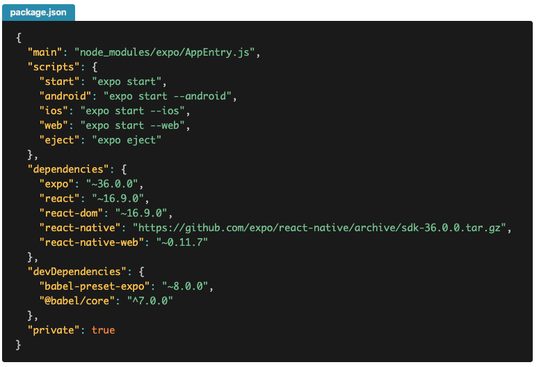
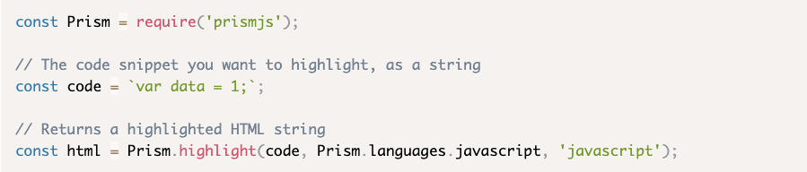
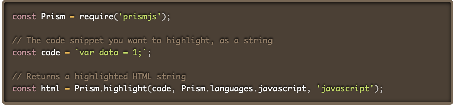
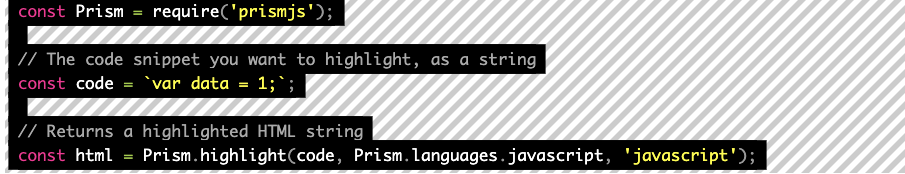
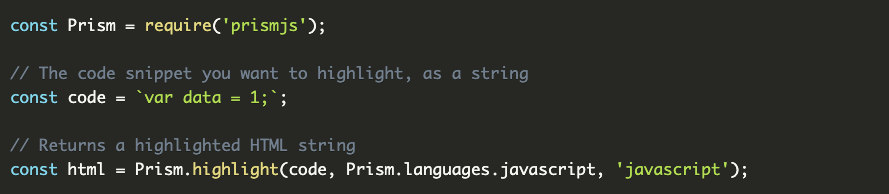
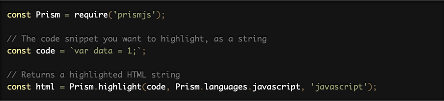
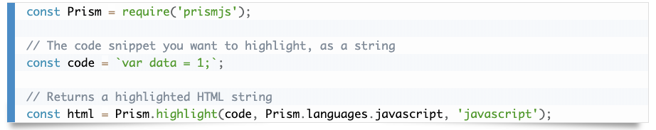
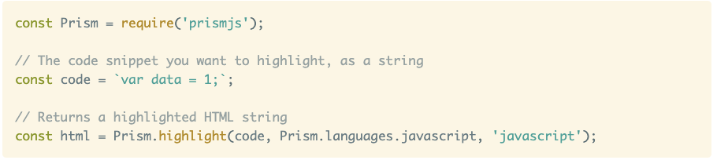
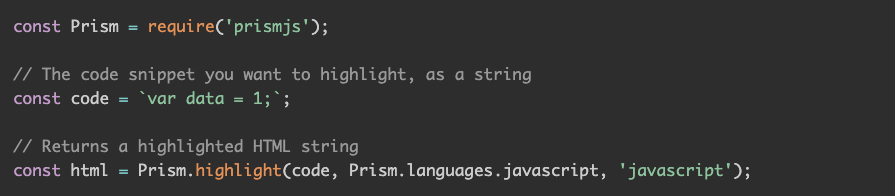

### まずやりたいこと

Gatsbyのブログにこんな感じでコードを書いたらシンタックスを色付けしたりファイル名を表示したい。




マークダウンでコードを書く場合はコードを` ``` `で囲む。

```text
```javascript
  const greeting = () => {
    return console.log("Hello world")
  }
```  
```

ただこのままではシンタックスもタイトルも表示されない。

そこで`gatsby-remark-prismjs`を導入します。

### install

```bash
// npm
npm install --save gatsby-transformer-remark gatsby-remark-prismjs prismjs

// yarn
yarn add gatsby-transformer-remark gatsby-remark-prismjs prismjs
```

#### cssを入れる

背景のカラーテーマがいくつか用意されていて、自分の好みのcssを導入する。  
詳しくはこちら（[PrismJS](https://prismjs.com/)）

最初は8種類数用意されています。

`prism.css`デファルト


`prism-dark.css`


`prism-funky.css`


`prism-okaidia.css`


`prism-twilight.css`


`prism-coy.css`


`prism-solarizedlight.css`


`prism-tomorrow.css`

  

そして`gatsby-browser.js`に好きなcssを読み込む。

```javascript:title=gatsby-browser.js
require("prismjs/themes/好きなcss.css")
```

#### config

`gatsby-config.js`にプラグインを設定する。

```javascript:title=gatsby-config.js
plugins: [
  {
    resolve: `gatsby-transformer-remark`,
    options: {
      plugins: [
        {
          resolve: `gatsby-remark-prismjs`,
          options: {
            classPrefix: "language-",
            inlineCodeMarker: null,
            aliases: {},
            showLineNumbers: true,
            noInlineHighlight: false,
          },
        },
      ],
    },
  },
]
```

##### prismjsのconfig

- `classPrefix` \<pre class='language-'>みたいにつけてくれます。
- `inlineCodeMarker` シングルバックティックの時にシンタックスを付加できるみたいなんですが、動かなかったので初期値のnullで。。。
- `aliases` javascript -> jsとかに置き換えられるれるみたい。
- `showLineNumbers` コードにラインナンバーを打つことができます。
require("prismjs/plugins/line-numbers/prism-line-numbers.css")を入れる必要があります。
falseにしといて個別のコードに表示もできます。最初の行の3連バックティックの後ろに` ```javascript{numberLines: true}`みたいな感じで表示できます。
- `noInlineHighlight` falseで特定の行にハイライトを入れられます。

その他にも細かい設定や言語のエクステンションもあるみたいです。
詳しくは[PrismJS](https://prismjs.com/) & [gatsby-remark-prismjs](https://www.gatsbyjs.org/packages/gatsby-remark-prismjs/)をご覧ください。

#### cssを変更する

あとは微調整のcssをあてれば完成です。
ちなみに私はtemplatesの中の`blog-post`という記事のテンプレートにcssをあててみました。

```css:title=blog-post.module.scss
.gatsby-highlight {
  font-size: 1.4rem;
}

pre[class*='language-'] {
  background-color: #1c1b1b;
  display: block;
  margin: 0 0 20px;
  padding-right: 1rem;
  padding-left: 2rem;
  border-radius: 0 4px 4px 4px;
}

code[class*='language-'],
pre[class*='language-'] {
  color: #fff;
}

:not(pre)>code[class*='language-text'] {
  font-size: 1.4rem;
  padding: 2px 10px 3px 12px;
  margin: 0 4px;
  background-color: #3c3c3c;
}

.gatsby-highlight-code-line {
  background: #545454;
  display: block
}
```

#### スニペットにタイトルをつける

このままでもいいですが、タイトルを表示したかったので`gatsby-remark-code-titles`を導入します。

```bash
// npm
npm install gatsby-remark-code-titles --save-dev
// yarn
yarn add gatsby-remark-code-titles
```

`gatsby-config.js`にプラグインを設定する。

```javascript:title=gatsby-config.js
plugins: [
  {
    resolve: `gatsby-transformer-remark`,
    options: {
      plugins: [
        {
          resolve: `gatsby-remark-prismjs`,
          options: {
            classPrefix: "language-",
            inlineCodeMarker: null,
            aliases: {},
            showLineNumbers: true,
            noInlineHighlight: false,
          },
        },
        `gatsby-remark-code-titles`, // highlight-line
      ],
    },
  },
]
```

これでタイトルが表示できます。使い方は3連バックティックの言語の後ろに`:title=タイトル名`で表示されます。

```text
```javascript:title=test.js
  const hello = 'hello'
```  
```

あとはタイトルのcssを少し整えて終了。

```css:title=blog-post.module.scss
.gatsby-code-title {
  background: #2e96b5;
  color: #eee;
  padding: 6px 12px;
  font-size: 0.8em;
  line-height: 1;
  font-weight: bold;
  display: table;
  border-radius: 4px 4px 0 0;
}
```

とりあえずの目標は達成できました。お疲れ様でした。
