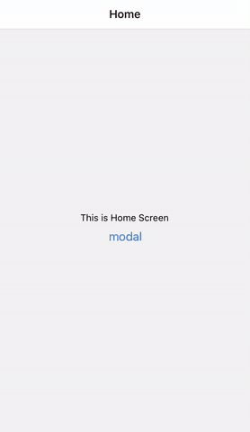
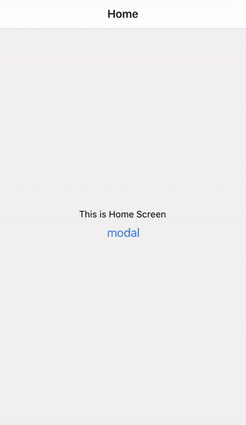

React Nativeでアプリが初回開かれた時に現れる初回のページを作成します。  
Walkthroughページともよばれていてそれ用のライブラリーもあるみたいですが今回はReactNativeのModalを使って自作してみます。  

### 今回やりたかったこと

こちらが完成

<!--  -->

ちなみにこんなライブラリもあります。  
[react-native-app-intro-slider](https://github.com/Jacse/react-native-app-intro-slider)  
[react-native-app-intro](https://github.com/fuyaode/react-native-app-intro)  

上記は非常に簡単に使えるのでためしてみてもいいと思います。  
ただ私が欲しかったのは最初のホーム画面は読み込みつつ、その画面上でモーダルとして背景を少しだけ透かしてチュートリアルを出したかったので諦めました。

### モーダルの作成

srcフォルダの中に`introModal.js`でコンポーネントを作成します

```javascript:title=introModal.js
import React, {useState,useRef} from 'react'
import {View, Text, Modal, Image, StyleSheet, FlatList, Dimensions} from 'react-native'

const IntroModal = ({isVisible, dismissModal}) => {

  const _renderItem = page => {
    const {item} = page;
    return (
        <View style={styles.slideInner}>
          <Image style={styles.img} source={item.image} />
          <Text style={styles.title}>{item.title}</Text>
          <Text style={styles.text}>{item.text}</Text>
        </View>
    );
  };
  const _keyExtractor = page => page.key;

  return (
    <Modal visible={isVisible} animationType="fade" transparent={true}>
      <View style={styles.container}>
        <FlatList
          data={slides}
          renderItem={_renderItem}
          horizontal={true}
          pagingEnabled
          showsHorizontalScrollIndicator={false}
          keyExtractor={_keyExtractor}
        />
      </View>
    </Modal>
  )
}

export default IntroModal;

const {width} = Dimensions.get('window');
const styles = StyleSheet.create({
  container: {
    flex: 1,
    justifyContent: 'center',
    alignItems: 'center',
    backgroundColor: 'rgba(240, 117, 108, 0.9)'
  },
  slideInner: {
    width: width,
    justifyContent: 'center',
    paddingBottom: 80,
    alignItems: 'center',
    paddingHorizontal: '5%',
  },
  img: {
    width: 100,
    height: 100,
  },
  title: {
    fontSize: 34,
    fontWeight: 'bold',
    textAlign: 'center',
    color: '#fff',
    marginTop: 8,
    marginBottom: 12,
  },
  text: {
    fontSize: 17,
    color: '#fff',
    textAlign: 'center',
    lineHeight: 30,
  },
})
```

- `horizontal`でスクロールを横に
- `pagingEnabled`で1つずつのデータをでストップしてくれます。  
widthが`const {width} = Dimensions.get('window');`になってるので1画面でストップしてくれます。
- `showsHorizontalScrollIndicator={false}`で下のスクロールを消します。

データを用意しておきます。形はなんでもいいんですが共通で使えるような形のオブジェクトで用意します。

```javascript:title=introModal.js
const SLIDES = [
  {
    key: '1',
    title: "This is first Slide",
    text: "This is first Slide This is first Slide This is first Slide This is first Slide",
    image: require('../assets/image1.png'),
  },
  {
    key: '2',
    title: "This is second Slide",
    text: "This is first Slide This is first Slide This is first Slide This is first Slide This is first Slide",
    image: require('../assets/image2.png'),
  },
  {
    key: '3',
    title: "This is Third Slide",
    text: "This is Third Slide This is Third Slide This is Third Slide",
    image: require('../assets/image3.png'),
  },
  {
    key: '4',
    title: "This is forth Slide",
    text: "This is forth Slide This is forth Slide This is forth Slide This is forth Slide This is forth Slide",
    image: require('../assets/image4.png'),
  },
];
```

表示したいScreenでコンポーネントを設置します。  
本来はAsyncStrageとかにはじめて起動したかどうかを保存しておいて、初回起動時のみに表示したりすればいいと思います。  
今回はHomeScreenでボタンを押したら表示されるようにしてみます。

```javascript:title=HomeScreen.js
import React, {useState, useEffect} from 'react';
import { View, Text, Button } from 'react-native';
import IntroModal from '../introModal';

const HomeScreen = ({ route, navigation }) => {
  const [isVisible, setIsVisible] = useState(false)

  const _dismissModal = () => {
    setIsVisible(false)
  }

  return (
    <View style={{ flex: 1, background: '#76dead', alignItems: 'center', justifyContent: 'center' }}>

      // Modalの設置
      <IntroModal isVisible={isVisible} dismissModal={_dismissModal}/>

      <Text>This is Home Screen</Text>
      <Button title="modal" onPress={() => {setIsVisible(true)}}/>
    </View>
  );
}

export default HomeScreen;
```



これでボタンを押したらモーダルが表示できました。

### Pagenationの設置

画像の下にdotのページネーションとボタンを設置します。


```javascript:title=IntroModal.js
const [viewableItemIndex, setViewableItemIndex] = useState(0);
const [buttonText, setButtonText] = useState('Next');

// ~~~ 略 ~~

// flatListのrefを作成
const flatListRef = useRef(null);

// onViewableItemsChangedで現在見えているviewを取得。
const onViewRef = useRef(({viewableItems}) => {
  // 現在の見えているItemのindexをuseStateに保存
  setViewableItemIndex(viewableItems[0].index);

  // 一番最後のスライドならボタンのテキストを変える
  if (viewableItems[0].index === SLIDES.lenght - 1) {
    setButtonText('Done');
  } else setButtonText('Next');
});

// buttonを押したら次のViewへ飛ぶ
const _onBottomButton = () => {
  if (viewableItemIndex < SLIDES.length - 1) {
    flatListRef.current.scrollToIndex({animated: true, index: viewableItemIndex + 1});
  } else {
    // propsでmodalを消す
    dismissModal();
  }
};

// dotを押したらそのindexのViewへ飛ぶ
const _onDot = index => {
  flatListRef.current.scrollToIndex({animated: true, index: index});
};

// dotの色を変える
function dotColor(index) {
  return index === viewableItemIndex ? styles.colorDot : styles.whiteDot;
}

// ~~~ 略 ~~~
      <FlatList
          data={SLIDES}
          horizontal={true}
          renderItem={_renderItem}
          pagingEnabled
          showsHorizontalScrollIndicator={false}
          keyExtractor={_keyExtractor}
          // ref で参照を指定
+         ref={flatListRef}
          // 見えているViewが変われば呼ばれる
+         onViewableItemsChanged={onViewRef.current}
        />

+       <View style={styles.bottomWrapper}>
          // pagenation
+       <View style={styles.dotWrapper}>
          // dot の作成
+         {SLIDES.map((listItem, index) => {
+           return (
+             <TouchableOpacity
+               onPress={() => _onDot(index)}
+               key={index}
+               style={[styles.dot, dotColor(index)]}
+             />
+           );
+         })}
+       </View>

        // botton
+       <TouchableOpacity style={styles.button} onPress={_onBottomButton}>
+         <Text style={styles.buttonText}>{buttonText}</Text>
+       </TouchableOpacity>
+     </View>
// ~~~ 略 ~~~

const styles = StyleSheet.create({
  // ~~~ 略 ~~~
+  bottomWrapper: {
+    position: 'absolute',
+    bottom: 70,
+    alignItems: 'center',
+  },
+  dotWrapper: {
+    flex: 1,
+    flexDirection: 'row',
+    justifyContent: 'center',
+    alignItems: 'center',
+  },
+  dot: {
+    width: 16,
+    height: 16,
+    borderRadius: 8,
+    marginHorizontal: 6,
+  },
+  colorDot: {
+    backgroundColor: '#FFA700',
+  },
+  whiteDot: {
+    backgroundColor: '#F2AB90',
+  },
+  button: {
+    marginTop: 18,
+  },
+  buttonText: {
+    fontSize: 19,
+    color: '#fff',
+  },
})
```

できあがりがこちら  



これでScreenではなくて背景が透けているmodalで表示できました。  
これなら結構柔軟に変更もできるんではないでしょうか。

### 最終のコードがこちら

```javascript:title=HomeScreen.js
import React, {useState, useEffect} from 'react';
import { View, Text, Button } from 'react-native';
import IntroModal from '../introModal';
// Home Screen
const HomeScreen = ({ route, navigation }) => {
  const [isVisible, setIsVisible] = useState(false)
  console.log('route', route)
  // const { welcome } = route.params;
  useEffect(()=> {

  },[])


  const _dismissModal = () => {
    setIsVisible(false)
  }
    
  return (
    <View style={{ flex: 1, background: '#76dead', alignItems: 'center', justifyContent: 'center' }}>
      <IntroModal isVisible={isVisible} dismissModal={_dismissModal}/>
      <Text>This is Home Screen</Text>
      <Button title="modal" onPress={() => {setIsVisible(true)}}/>
    </View>
  );
}

export default HomeScreen;
```

```javascript:title=IntroModal.js
import React, {useState,useRef} from 'react'
import {View, Text, Modal, Image, StyleSheet, TouchableOpacity, FlatList, Dimensions} from 'react-native'

const IntroModal = ({isVisible, dismissModal}) => {
  const [viewableItemIndex, setViewableItemIndex] = useState(0);
  const [buttonText, setButtonText] = useState('Next');

  const _renderItem = page => {
    const {item} = page;
    return (
        <View style={styles.slideInner}>
          <Image style={styles.img} source={item.image} />
          <Text style={styles.title}>{item.title}</Text>
          <Text style={styles.text}>{item.text}</Text>
        </View>
    );
  };
  const _keyExtractor = page => page.key;

  const flatListRef = useRef(null);

  const onViewRef = useRef(({viewableItems}) => {
    setViewableItemIndex(viewableItems[0].index);
    if (viewableItems[0].index === SLIDES.length - 1) {
      setButtonText('Done');
    } else {
      setButtonText('Next');
    }
  });

  const _onBottomButton = () => {
    if (viewableItemIndex < SLIDES.length - 1) {
      flatListRef.current.scrollToIndex({animated: true, index: viewableItemIndex + 1});
    } else {
      dismissModal();
    }
  };

  const _onDot = index => {
    flatListRef.current.scrollToIndex({animated: true, index: index});
  };

  function dotColor(index) {
    return index === viewableItemIndex ? styles.colorDot : styles.whiteDot;
  }


  return (
    <Modal visible={isVisible} animationType="fade" transparent={true}>
      <View style={styles.container}>
        <FlatList
          data={SLIDES}
          horizontal={true}
          renderItem={_renderItem}
          pagingEnabled
          showsHorizontalScrollIndicator={false}
          keyExtractor={_keyExtractor}
          ref={flatListRef}
          onViewableItemsChanged={onViewRef.current}
        />

        <View style={styles.bottomWrapper}>
          <View style={styles.dotWrapper}>
            {SLIDES.map((listItem, index) => {
              return (
                <TouchableOpacity
                  onPress={() => _onDot(index)}
                  key={index}
                  style={[styles.dot, dotColor(index)]}
                />
              );
            })}
          </View>
          <TouchableOpacity style={styles.button} onPress={_onBottomButton}>
            <Text style={styles.buttonText}>{buttonText}</Text>
          </TouchableOpacity>
        </View>
      </View>
    </Modal>
  )
}

export default IntroModal;

const {width} = Dimensions.get('window');
const styles = StyleSheet.create({
  container: {
    flex: 1,
    justifyContent: 'center',
    alignItems: 'center',
    backgroundColor: 'rgba(240, 117, 108, 0.9)'
  },
  space: {
    paddingTop: 40,
  },
  slideInner: {
    width: width,
    justifyContent: 'center',
    paddingBottom: 80,
    alignItems: 'center',
    paddingHorizontal: '5%',
  },
  img: {
    width: 100,
    height: 100,
  },
  title: {
    fontSize: 34,
    fontWeight: 'bold',
    textAlign: 'center',
    color: '#fff',
    marginTop: 8,
    marginBottom: 12,
  },
  text: {
    fontSize: 17,
    color: '#fff',
    textAlign: 'center',
    lineHeight: 30,
  },
  bottomWrapper: {
    position: 'absolute',
    bottom: 70,
    alignItems: 'center',
  },
  dotWrapper: {
    flex: 1,
    flexDirection: 'row',
    justifyContent: 'center',
    alignItems: 'center',
  },
  dot: {
    width: 16,
    height: 16,
    borderRadius: 8,
    marginHorizontal: 6,
  },
  colorDot: {
    backgroundColor: '#FFA700',
  },
  whiteDot: {
    backgroundColor: '#F2AB90',
  },
  button: {
    marginTop: 18,
  },
  buttonText: {
    fontSize: 19,
    color: '#fff',
  },
})

const SLIDES = [
  {
    key: '1',
    title: "This is first Slide",
    text: "This is first Slide This is first Slide This is first Slide This is first Slide",
    image: require('../assets/image1.png'),
  },
  {
    key: '2',
    title: "This is second Slide",
    text: "This is first Slide This is first Slide This is first Slide This is first Slide This is first Slide",
    image: require('../assets/image2.png'),
  },
  {
    key: '3',
    title: "This is Third Slide",
    text: "This is Third Slide This is Third Slide This is Third Slide",
    image: require('../assets/image3.png'),
  },
  {
    key: '4',
    title: "This is forth Slide",
    text: "This is forth Slide This is forth Slide This is forth Slide This is forth Slide This is forth Slide",
    image: require('../assets/image4.png'),
  },
];
```