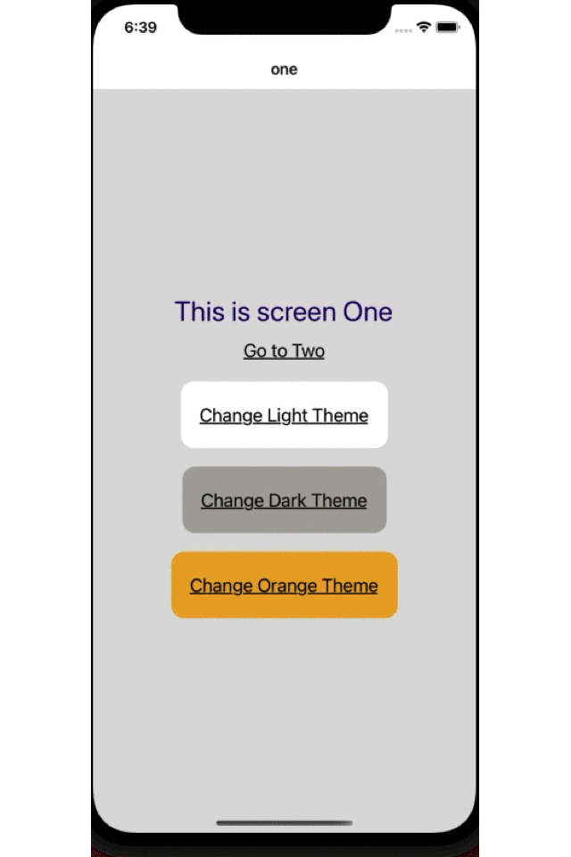

複数のテーマをアプリ起動中に動的に変更したい。しかもランタイムで。
いちいちアプリを立ち上げなおしたくないし、Dark mode,Light mode以外も入れれたら最高かも。
### 今回やりたかったこと
そしてできたサンプルが下の画像です。



### 要件 ・ 必要なこと

環境

- react-native 0.63.4
- typescript

ReactNative のアプリで theme を入れるのは複数の方法があると思いますが、一番簡単なのは ReactNative が用意している`Appearance`と`useColorSchem`の API です。
ただこれだと Dark mode か Light mode かしか切り替えができません。
[Expo Example](https://docs.expo.dev/guides/color-schemes/#example)にも書いてありますが、これではコンポーネントごとに light theme かどうかをチェックして切り替えなければなりません。
他にも、[ReactNavigation](https://reactnavigation.org/docs/5.x/themes)も Theme を提供しています。これは Theme の定義は別で用意できるのでいいかもしれません。
[styled-components](https://styled-components.com/docs/advanced)も Theme があります。ただ Theme のためだけにこのライブラリを入れたくないという気持ち。bundle size がそこそこあるのよね。
一番良さそうだったのは[react-theme-provider](https://www.npmjs.com/package/@callstack/react-theme-provider)でこれはほぼ私の欲しい物が入ってる感じでした。

- できるだけ Theme の定義は一つにまとめたい。
- このためだけにライブラリは入れたくない。
- 複数の Theme をもちたい。
- ランタイムで変更
- パフォーマンスやパッケージサイズも注意

そんな感じで自作してみます。
ちなみにこちらの[海外の記事](https://medium.com/supercharges-mobile-product-guide/reactive-styles-in-react-native-79a41fbdc404)を参考に少し手を加えてます。

### 色の定義

まずそれぞれのテーマのカラーを定義します。

```javascript:title=src/style/color/DefaultLight.ts
// Define our dark theme colors
import { ColorTheme } from '../type';
export const DEFAULT_DARK_COLOR_THEME: ColorTheme = {
  Palette: {
    primary: '#03a9f4',
    onPrimary: '#800026',
    surface: '#545454',
    onSurface: '#fff',
    baseBackground: '#3f3f3f',

    white: '#fff', // どんなテーマでも白のときのみ使用
    black: '#000', // どんなテーマでも黒のときのみ使用
  },
  Text: {
    primary: '#ddf7c3',
  },
  ButtonAtom: {
    PrimaryBackGround: '#ebc0df',
    SecondaryBackGround: '#b8c7d4',
    Attention: '#ff1f4f',
  },
};
```

Dark, Orange も同じ内容で色違いを定義します。

- `/src/style/color/DefaultDark.ts`
- `/src/style/color/DefaultOrange.ts`

`/src/style/type` を用意して type を定義。
それぞれのテーマのオブジェクトを作成。

```javascript:title=src/style/type.ts
export interface ColorTheme {
  Palette: {
    primary: string,
    onPrimary: string,
    surface: string,
    onSurface: string,
    baseBackground: string,

    white: string,
    black: string,
  };
  Text: {
    primary: string,
  };
  ButtonAtom: {
    PrimaryBackGround: string,
    SecondaryBackGround: string,
    Attention: string,
  };
}
```

それぞれの Theme の型も定義しておきます。

```javascript:title=src/style/type.ts
// ...
// 略

// Dark Theme
export const DEFAULT_DARK_THEME: Theme = {
  id: EThemeID.DEFAULT_DARK_THEME_ID,
  color: DEFAULT_DARK_COLOR_THEME,
  spacing: DEFAULT_SPACING_THEME, // we can create another spacinge theme depends on theme
};

// Light Theme
export const DEFAULT_LIGHT_THEME: Theme = {
  id: EThemeID.DEFAULT_LIGHT_THEME_ID,
  color: DEFAULT_LIGHT_COLOR_THEME,
  spacing: DEFAULT_SPACING_THEME, // we can create another spacinge theme depends on theme
};

// Orange Theme
export const DEFAULT_ORANGE_THEME: Theme = {
  id: EThemeID.DEFAULT_ORANGE_THEME_ID,
  color: DEFAULT_ORANGE_COLOR_THEME,
  spacing: DEFAULT_SPACING_THEME, // we can create another spacinge theme depends on theme
};
```

ここでThemeはidとcolorとspacingを定義しています。
ここで気をつけたのはカラーとスペースの定義を分けたことです。
Theme を宣言する他の例をいくつか探しましたが、一緒に Theme としてカラーとスペースやフォントなどを一つにまとめてるものをよく見かけました。Theme が変わってもレイアウトのスペースやフォントが変わるとは考えにくいので別で一つに集約しています。

ちなみにスペースはこんな感じ。
```javascript:title=src/style/space/DefaultSpacing.ts
import {SpacingTheme} from '../type';

export const DEFAULT_SPACING_THEME: SpacingTheme = {
  base: 6,
  base_8: 8,
  base_10: 10,
  base_12: 12,
  base_20: 20,
};
```
font も別でまとめて定義しておいてThemeに読み込んでおくのがいいと思います。

### Theme Context の作成

Theme の情報は Context API でグローバルに保持しておきます。

```javascript:title=src/style/ThmeContext.tsx
import React from 'react';
import { DEFAULT_DARK_THEME, DEFAULT_LIGHT_THEME, DEFAULT_ORANGE_THEME } from './type';
import { Theme, EThemeID } from './type';

// Context Providerの型 
export interface ProvidedValue {
  theme: Theme;
  toggleTheme: (id?: EThemeID) => void;
}

// Context の作成
export const Context = React.createContext<ProvidedValue>({
  theme: DEFAULT_LIGHT_THEME,
  toggleTheme: () => {
    console.log('ThemeProvider is not rendered!');
  },
});

interface ThemeProviderProps {
  initial: Theme;
  children?: React.ReactNode;
}

// React.memo でmemoしてoptimization
export const ThemeProvider = React.memo<ThemeProviderProps>(props => {
  // 実際の使用してるThemeを保持
  const [theme, setTheme] = React.useState<Theme>(props.initial);

  // Themeを変更するときのfunction。useCallbackでoptimization
  const ToggleThemeCallback = React.useCallback((id?: EThemeID) => {
    setTheme(currentTheme => {
      if (currentTheme.id === id || !id) {
        return currentTheme;
      }
      switch (id) {
        case EThemeID.DEFAULT_LIGHT_THEME_ID:
          return DEFAULT_LIGHT_THEME;
        case EThemeID.DEFAULT_DARK_THEME_ID:
          return DEFAULT_DARK_THEME;
        case EThemeID.DEFAULT_ORANGE_THEME_ID:
          return DEFAULT_ORANGE_THEME;
        default:
          return DEFAULT_LIGHT_THEME;
      }
    });
  }, []);

  // ContenxtにわたすProviderを作成。useMemoでreturnのValueをMemo。
  const MemoizedValue = React.useMemo(() => {
    const value: ProvidedValue = {
      theme,
      toggleTheme: ToggleThemeCallback,
    };
    return value;
  }, [theme, ToggleThemeCallback]);

  // Context Providerをreturnしてchildrenを受ける。
  return <Context.Provider value={MemoizedValue}>{props.children}</Context.Provider>;
});

// hooksのコンポーネントでuseContextを使うために作成
export const useTheme = () => React.useContext(Context);
```

#### Theme Providerを設置

```javascript:title=App.tsx
import React from 'react';
import {NavigationContainer} from '@react-navigation/native';
import {DEFAULT_LIGHT_THEME} from './src/style/type';
import {ThemeProvider} from './src/style/ThemeContext';

import {RootStack} from './src/RootStack';

const App = () => {
  return (
    // 初期テーマは任意のものを設置、とりあえずLight themeを設置
    <ThemeProvider initial={DEFAULT_LIGHT_THEME}>
      <NavigationContainer>
        <RootStack />
      </NavigationContainer>
    </ThemeProvider>
  );
};
export default App;

```


### Screen を作る
Screen OneとScreen two の２つを用意しました。

```javascript:title=src/screens/ScreenOne.tsx
import React from 'react';
import {View, Text, StyleSheet, TouchableOpacity} from 'react-native';
import {EThemeID, Theme} from '../style/type';
import {useThemeAwareObject} from '../style/ThemeHooks';

export const ScreenOne: React.FC<{navigation: any}> = ({navigation}) => {
  // ContextAPI から取得
  const { theme, toggleTheme } = useTheme();

  // createStylesのファンクションにContextにあるthemeを渡してstyleを取得
  const styles = () => createStyles(theme)

  return (
    <View style={styles.container}>
      <Text style={styles.textStyle}>This is screen One</Text>
      <TouchableOpacity onPress={() => navigation.navigate('two')}>
        <Text style={styles.linkStyle}>Go to Two</Text>
      </TouchableOpacity>
      <TouchableOpacity
        onPress={() => toggleTheme(EThemeID.DEFAULT_LIGHT_THEME_ID)}>
        <View style={[styles.buttonBase, styles.buttonWrapper]}>
          <Text style={styles.linkStyle}>Change Light Theme</Text>
        </View>
      </TouchableOpacity>
      <TouchableOpacity
        onPress={() => toggleTheme(EThemeID.DEFAULT_DARK_THEME_ID)}>
        <View style={[styles.buttonBase, styles.buttonWrapper_2]}>
          <Text style={styles.linkStyle}>Change Dark Theme</Text>
        </View>
      </TouchableOpacity>
      <TouchableOpacity
        onPress={() => toggleTheme(EThemeID.DEFAULT_ORANGE_THEME_ID)}>
        <View style={[styles.buttonBase, styles.buttonWrapper_3]}>
          <Text style={styles.linkStyle}>Change Orange Theme</Text>
        </View>
      </TouchableOpacity>
    </View>
  );
};

// styleを作るfanction。returnでStyleSheetのオブジェクトを返す。
const createStyles = (theme: Theme) => {
  const styles = StyleSheet.create({
    container: {
      backgroundColor: theme.color.Palette.baseBackground,
      flex: 1,
      alignItems: 'center',
      justifyContent: 'center',
    },
    textStyle: {
      fontSize: 30,
      color: theme.color.Text.primary,
    },
    linkStyle: {
      fontSize: 20,
      color: theme.color.Palette.onSurface,
      textDecorationLine: 'underline',
      marginVertical: theme.spacing.base_12,
    },
    buttonBase: {
      marginVertical: theme.spacing.base_10,
      paddingVertical: theme.spacing.base_12,
      paddingHorizontal: theme.spacing.base_20,
      borderRadius: 14,
    },
    buttonWrapper: {
      backgroundColor: theme.color.ButtonAtom.PrimaryBackGround,
    },
    buttonWrapper_2: {
      backgroundColor: theme.color.ButtonAtom.SecondaryBackGround,
    },
    buttonWrapper_3: {
      backgroundColor: theme.color.ButtonAtom.Attention,
    },
  });
  return styles;
};

```

```javascript:title=src/screens/ScreenTwo.tsx
import React from 'react';
import {View, Text, StyleSheet, TouchableOpacity} from 'react-native';
import {useThemeAwareObject} from '../style/ThemeHooks';
import {Theme} from '../style/type';

export const ScreenTwo: React.FC<{navigation: any}> = props => {
  // ContextAPI から取得
  // このスクリーンはカラーを変更するボタンがないのでthemeだけ使用
  const { theme } = useTheme();

  // createStylesのファンクションにContextにあるthemeを渡してstyleを取得
  const styles = () => createStyles(theme)

  return (
    <View style={styles.container}>
      <Text style={styles.textStyle}>This is screen Two</Text>
      <TouchableOpacity onPress={() => props.navigation.navigate('one')}>
        <Text style={styles.linkStyle}>Go to One</Text>
      </TouchableOpacity>
      <View style={styles.cricle} />
    </View>
  );
};

const createStyles = (theme: Theme) => {
  const styles = StyleSheet.create({
    container: {
      backgroundColor: theme.color.Palette.baseBackground,
      flex: 1,
      alignItems: 'center',
      justifyContent: 'center',
    },
    textStyle: {
      fontSize: 30,
      color: theme.color.Text.primary,
    },
    linkStyle: {
      fontSize: 20,
      color: theme.color.Palette.onSurface,
      textDecorationLine: 'underline',
      marginVertical: theme.spacing.base_12,
    },
    buttonWrapper: {
      backgroundColor: theme.color.ButtonAtom.SecondaryBackGround,
      paddingVertical: theme.spacing.base_12,
      paddingHorizontal: theme.spacing.base_20,
      borderRadius: 14,
    },
    cricle: {
      width: 60,
      height: 60,
      borderRadius: 30,
      backgroundColor: theme.color.Palette.onPrimary,
      marginTop: theme.spacing.base_20,
    },
  });
  return styles;
};

```

これでだいぶ出来てきました。

ただしこれではComponentがre-renderされるたびにcreateStylesが呼び出されてstyleのオブジェクトが毎回生成されます。

たまに他のサイトでThemeのExampleを見かけますが、componentの中で毎回styleのオブジェクトを作成しているのもあります。

Re-rendeのたびに毎回新しいオブジェクトが生成されるのでコンポーネントの数が増えるとアプリのパフォーマンスにかかわります。

### Custom hookを作成
最適化のためにカスタムフックを作ります。
re-renderが走ったときになんども新しいオブジェクトを作るのを防ぎます。

```javascript:title=src/style/ThemeHooks.tsx
import React from 'react';
import {Theme} from './type';
import {useTheme} from './ThemeContext';

// それぞれのscreenで作るcreateStylesの型と同じになるようにGeneric型
type Generator<T extends {}> = (theme: Theme) => T;

const useThemeAwareObject = <T extends {}>(fn: Generator<T>) => {
  // ContextAPIから取得
  const {theme, toggleTheme} = useTheme();
  // createStylesのfunctionを渡してthemeからstyleのオブジェクトを作成。
  // memo化しているのでfunctionかthemeが変更になったときだけ
  // styleが作り直される。
  const styles = React.useMemo(() => fn(theme), [fn, theme]);
  return {styles, toggleTheme};
};

export {useThemeAwareObject};

```

このカスタムフックの中でstyleを作成するのですが、memoしているので返ってくる同じです。

何度re-rendringが入っても即座にmemoの内容を返すので何度もオブジェクトが生成されることはありません。

あとはそれぞれのスクリーンでこのカスタムフックを呼び込むだけ。どれだけcomponentがre-renderされてもstyleは最初の一回きりの作成になります。

### 完成

使い方はいたって簡単。

```javascript:title=src/Screens/ScreenOne.tsx
export const ScreenOne: React.FC<{navigation: any}> = ({navigation}) => {
  // custom Hookを呼び出してstyleを作成
  const {styles, toggleTheme} = useThemeAwareObject(createStyles);

  return (
    <View style={styles.container}>
    {/* ...省略 */}
    </View>
  );
};

// componentの外なのでreactのライフサイクルのように何度も作成されない。
// useThemeAwareObjectは同じレファレンスを参照
const createStyles = (theme: Theme) => {
  const styles = StyleSheet.create({
    // ...省略
  });
  return styles;
};
```
```javascript:title=src/Screens/ScreenTwo.tsx
export const ScreenOne: React.FC<{navigation: any}> = ({navigation}) => {
  // custom Hookを呼び出してstyleを作成
  // 必要なのはstyleだけでthemeを変更するtoggleはこのページでは使わない
  const {styles} = useThemeAwareObject(createStyles);

  return (
    <View style={styles.container}>
    {/* ...省略 */}
    </View>
  );
};

// componentの外なのでreactのライフサイクルのように何度も作成されない。
// useThemeAwareObjectは同じレファレンスを参照
const createStyles = (theme: Theme) => {
  const styles = StyleSheet.create({
    // ...省略
  });
  return styles;
};
```

ちなみにファイル構造は

```
App.tsx
index.js
package.json
...
src/
  ┣━ RootStack.tsx
  ┃
  ┣━ Screens/
  ┃   ┣━ ScreenOne.tsx
  ┃   ┗━ ScreenTwo.tsx
  ┃
  ┗━ style
      ┣━ color
      ┃   ┣━ DefaultDark.ts
      ┃   ┣━ DefaultLight.ts
      ┃   ┗━ DefaultOrange.ts
      ┃
      ┣━ space
      ┃   ┗━ DefaultSpacing.ts 
      ┣━ ThemeContext.tsx
      ┣━ ThemeHooks.tsx
      ┗━ type.ts 
```

あとは実際にパフォーマンスに問題ないかちゃんとしたアプリで計測して見ないとわかりません。
変更したThemeはAsyncStrageなどなにかしら保存する方法が必要だと思います。
残念なのはデバイスの設定ではアプリのThemeは変更されないことになります。
もしデバイスの設定に合わせるならもっと簡単にできるかもしれません。
ただ今回のほしかった機能としてはライブラリの追加無しでできたので使えるそうな気がしてます。


